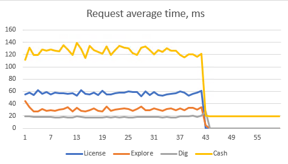
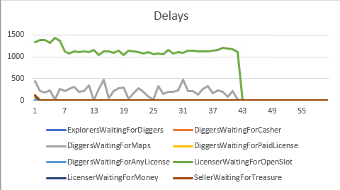
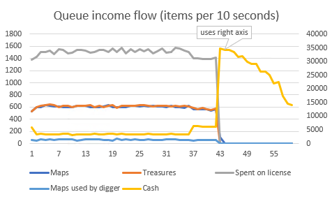
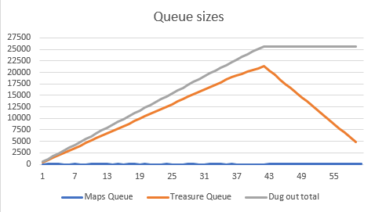
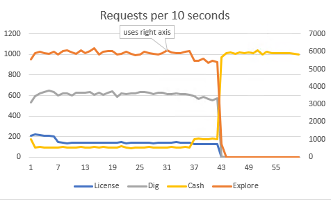

# Highload cup 2021
Implementation of client (and test server) for mail.ru [highload cup 2021](https://cups.mail.ru/ru/contests/goldrush).

Exploration / gold digging client implementation competition.
102th place with the score of 564143.
Testing was done in virtualized environment,
Client has 4 cores, 2Gb RAM / 2Gb swap, 900 seconds timeout.
Server has 2 cores, 2Gb RAM / 2Gb swap, 900 seconds timeout.

Solution has 3 priority queues, queue of unexplored areas, queue for explored 1x1 maps prepared for digging,
and a queue of dug-out treasures prepared for cashing. Also a pool of 10 active licenses, constantly
filled up by a licensing task.

Exploration is done in squares 4x4, breaking down each square into 2x2 and further into 1x1, discarding empty ones.
Initially exploration was done in 16x16 squares, but 4x4 proved to yield better results.

Digging is done up to level 10 (levels less than 10 proved to have worse yield), with first 3 levels using free license
if no better license available (only for first 10 seconds).

Cashing is done by one idle task for first 7 minutes (to provide license money), last 3 minutes 2 cashers active, 
no digging/explore/license activity, to provide max throughput.

## Statistics

Average cashing time is 20ms when no other activity present, 120ms otherwise:

Most delays are from waiting for expired license, and some maps queue contention:

Since we are selling more expensive treasures first, there is a noticable decay in treasure yield in the last 3 minutes.
Maps and treasures queue income is balanced out.

Best result in number of dug out treasures is 25K. Max treasure queue size I could get is around 20K by 7th minute.

Exploration has 600 RPS (with cap of 1000), balanced out by digging activity. Running exploration first and then digging and selling
proved to be a worse strategy.

